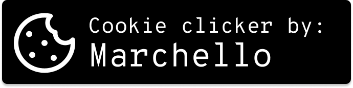

This project was created for a tutorial that covers actions and an interactive button in JS.


# System Levels and Notifications

Using [pnotify](https://www.npmjs.com/package/pnotify) I was able to create a level system. Also made a notification about counter reset.

## Code:

```JavaScript
import { success, info } from "@pnotify/core"
import "@pnotify/core/dist/PNotify.css"
import "@pnotify/core/dist/BrightTheme.css"
import './styles/reset.scss'
import './styles/style.scss'

Object.entries(LEVELS).forEach(([key, value]) => {
    if (i == value) {
        success({
            text: `Congratulations! You have a new level: ${key}`,
            delay: 2500,
            sticker: false, 
            hide: true,     
        })
    }
})

htmlElements.resetButton.addEventListener('click', () => {
    i = 0
    
    htmlElements.textCounter.textContent = i
    localStorage.setItem("cookieCount", i)

    info({
        text: `The counter has been reset.`,
        delay: 2500,
        sticker: false, 
        hide: true,   
    })
})

```

## Example:


# Figma link

https://www.figma.com/design/F2WOhlhoiEBrJDfJDH9oqy/Untitled?node-id=0-1&t=T8ISFI3XEzaSOKGj-1